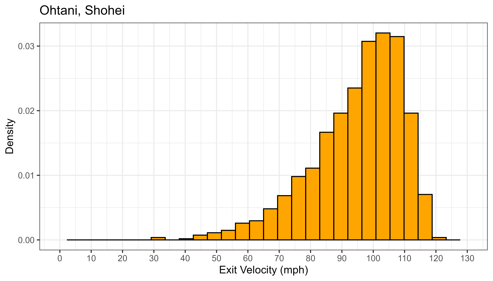
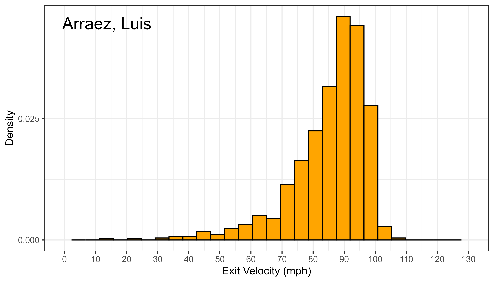
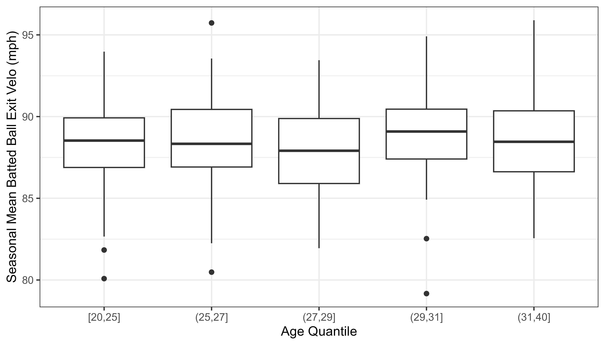
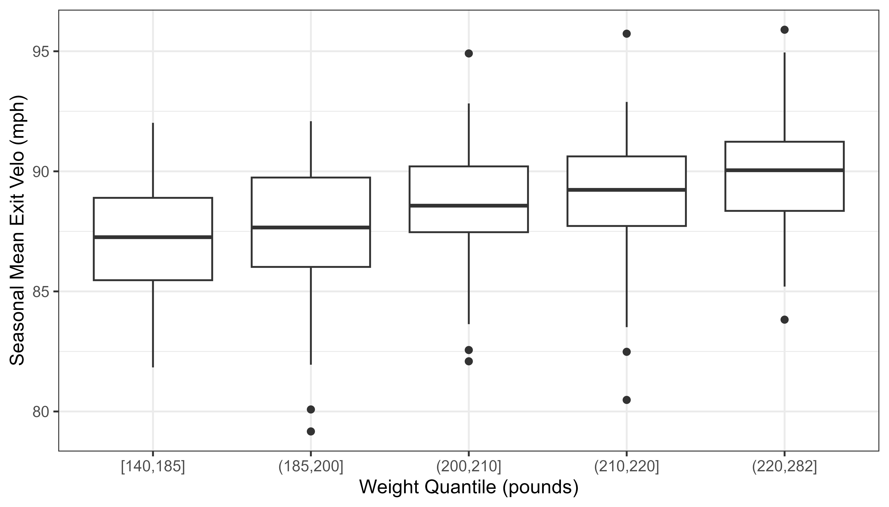
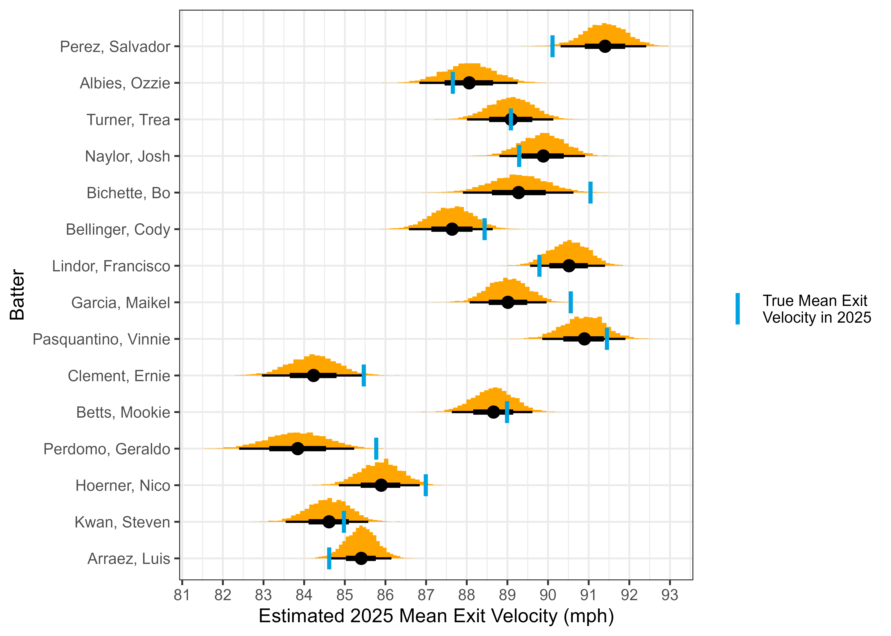
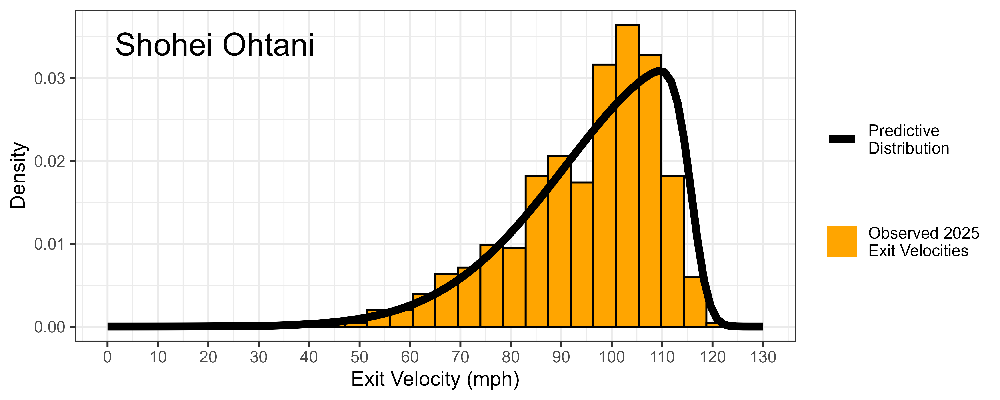
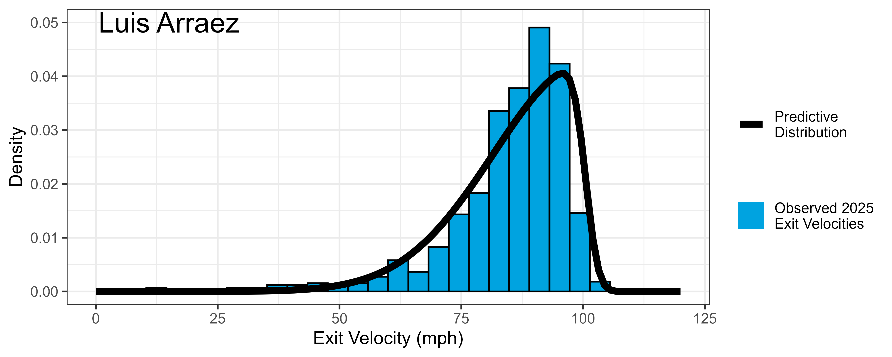

# Bayesian Hierarchical Modelling for Projecting MLB Batter's Future Exit Velocities

## Overview
- **Goal**: Estimate MLB batter's mean exit velocity for future seasons. 
- **Approach**: Use Bayesian hierarchical modelling in R and stan to create predictive distributions for a batter's future exit velocity. From those distributions, estimate the batter's mean exit velocity for the following season.
- Several key advantages:
  1. **Better predictions**: Parameter shrinkage from hierarchical modelling greatly improves predictions.
  2. **Better player understanding**: Predictive distributions give a holistic perspective to a player's batting style.
  3. **Uncertainty quantification**: Estimated uncertainty in player's future performance gives even more info for decision making.
  4. **Able to simulate new players**: Players who have no prior data, such as international or minor league players, can still be projected.

## Data
- Used the [baseballr](https://billpetti.github.io/baseballr/) package for batted ball info and the [Sean Lahman Baseball Database](https://cran.r-project.org/web/packages/Lahman/index.html) for player height and weight info.
- Collected over 250,000 batted ball observations for 394 players across the 2024, 2025 MLB seasons.
- Train model on 2024 season, evaluate on 2025 season.

## Exploratory Data Analysis
<p align="center">
  <em>Distribution of Shohei Ohtani's and Luis Arraez's Exit Velocities from the 2024-2025 seasons.</em>
</p>
<p align="center">
  
  
</p>


- Feature relationships:
<p align="center">
  <em>Seasonal Mean Exit Velocity vs Batter Age and Weight Quantile.</em>
</p>
<p align="center">
  
  
</p>


- Main findings:
   - Batter exit velocites follow a [skew normal distribution](https://en.wikipedia.org/wiki/Skew_normal_distribution).
   - Batter's have distinctly different distributions. 
   - Heavier batters hit the ball harder than lighter batters - include weight effect in model.
   - Exit velocity stable across all batter ages - do not include age effect in model. 

## Model 
- Consider $Y_{ij}$ as the $i^{th}$ batted ball exit velocity from batter $j$. Assume:
```math
Y_{ij} \sim \text{SkewNormal}(\zeta_j + \delta \cdot \text{weight}_j,\ \omega_j,\ \alpha)
```
and assign priors:
```math
\zeta_j \sim \text{Normal}(\mu_\zeta, \sigma_\zeta), \;\; \omega_j \sim \text{Normal}(\mu_\omega, \sigma_\omega), \;\; \delta \sim \text{Normal}(0,1), \;\; \alpha \sim \text{Normal}(0,1)
```
```math
\mu_\zeta \sim \text{Normal}(110, 5), \;\; \mu_\omega \sim \text{Normal}(25, 2), \;\; \sigma_\zeta, \sigma_\omega \sim \text{Normal}_+(0,2)
```
- Each player has their own location and scale parameter. These are partially pooled.
- Skew parameter is common across all players.
- Modelling done in [stan](https://mc-stan.org/docs/functions-reference/unbounded_continuous_distributions.html#skew-normal-distribution).

## Results
<div align="center">
<table>
  <caption><b>Table 1:</b> Prediction Results</caption>
  <thead>
    <tr>
      <th></th>
      <th>Prediction Error (RMSE)</th>
    </tr>
  </thead>
  <tbody>
    <tr>
      <td>Previous season's mean</td>
      <td>2.22</td>
    </tr>
    <tr>
      <td>My model</td>
      <td>2.04</td>
    </tr>
  </tbody>
</table>
</div>

- On average, model is 2.04 mph off of true seasonal mean exit velocities in 2025. Improvement on the naive approach that uses previous season's mean exit velocity as a guess for the next season.

<p align="center">
  <em>Predicted Player Mean Exit Velocity in 2025. The 95% credible intervals are shown.</em>
</p>
<p align="center">
  
</p>

- Most 2025 mean exit velocities lie within the 95% credible intervals.
- Indicates that the predictive distributions built on the previous season projects the batter's exit velocities of the following season well.
- Projecting on a shorter term basis (game to game) would increase the validity of these intervals.


<p align="center">
  <em>Predictive Exit Velocity Distributions for Shohei Ohtani and Luis Arraez.</em>
</p>
<p align="center">
  
  
</p>

- Predictive distributions match well with the observed 2025 exit velocities.
- Gives more understanding of a batter's style:
  - Ohtani being a slugger has higher max exit velocity but more variability.
  - Luis being a contact hitter has lower max exit velocity but tighter range (more consistent).
- Useful for evaluating things like: setting the batting order, determining whether player is recovered from injury, evaluating if new hitting mechanics are beneficial, etc. 


## Future Work
- Incorporating more features into the model. For example:
    - player age effects. Over the past few seasons, is there an upward or downward trend in the batter's exit velocity
    - player streakiness. Over the past few games, has the batter been hitting the ball well or poorly?
    - level effects. Is there a decrease in exit velocity from being promoted to mlb from the minors or an international league? 
