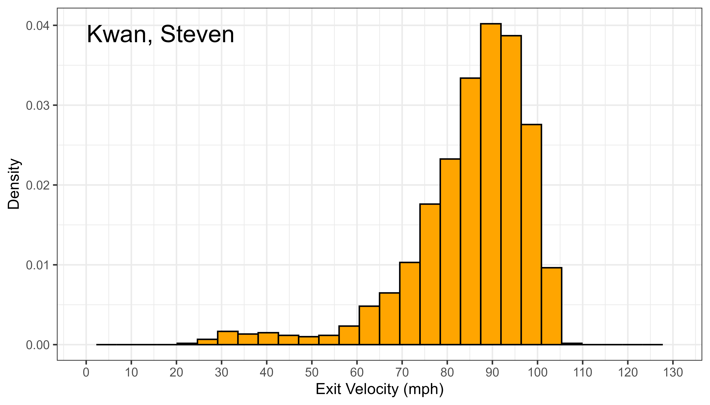
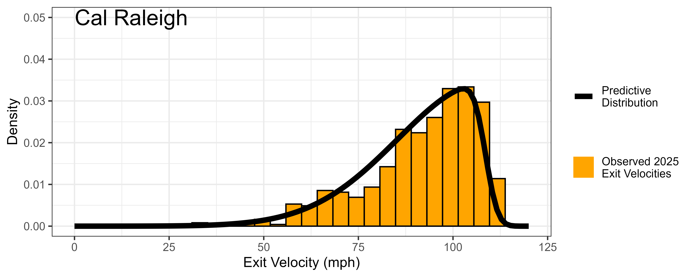

# Bayesian Hierarchical Modelling for Projecting MLB Batter's Future Exit Velocities

## Overview
- **Goal**: Estimate MLB batter's mean exit velocity for future seasons. 
- **Approach**: Use Bayesian hierarchical modelling to create predictive distributions for a batter's future exit velocity. From those distributions, estimate the batter's mean exit velocity for the following season.
- Several key advantages:
  1. **Better predictions**: Parameter shrinkage from hierarchical modelling greatly improves predictions.
  2. **Better player understanding**: Predictive distributions give a holistic perspective to a player's batting style.
  3. **Uncertainty quantification**: Estimated uncertainty in player's future performance gives even more info for decision making.
  4. **Able to simulate new players**: Players who have no prior data, such as international or minor league players, can still be projected.

## Data
- Used the [baseballr](https://billpetti.github.io/baseballr/) package for batted ball info and the [Sean Lahman Baseball Database](https://cran.r-project.org/web/packages/Lahman/index.html) for player height and weight info.
- Collected over 250,000 batted ball observations for 394 players across the 2024, 2025 MLB seasons.
- Train model on 2024 season, evaluate on 2025 season.

## Exploratory Data Analysis
- The distribution of batter's exit velocities:
<p align="center">
  
  
</p>
<p align="center">
  <em>Distribution of Shohei Ohtani's and Steven Kwan's Exit Velocities from the 2024-2025 seasons.</em>
</p>

- Feature relationships:
<p align="center">
  
  
</p>
<p align="center">
  <em>Seasonal Mean Exit Velocity vs Batter Age and Weight Quantile.</em>
</p>

- Main findings:
   - Batter exit velocites follow a [skew normal distribution](https://en.wikipedia.org/wiki/Skew_normal_distribution).
   - Heavier batters hit the ball harder than lighter batters - include weight effect in model.
   - Exit velocity stable across all batter ages - do not include age effect in model. 

## Model 
- Consider $Y_{ij}$ as the $i^{th}$ batted ball exit velocity from batter $j$. Assume:
```math
Y_{ij} \sim \text{SkewNormal}(\zeta_j + \delta \cdot \text{weight}_j,\ \omega_j,\ \alpha)
```
and assign priors:
```math
\zeta_j \sim \text{Normal}(\mu_\zeta, \sigma_\zeta), \;\; \omega_j \sim \text{Normal}(\mu_\omega, \sigma_\omega), \;\; \delta \sim \text{Normal}(0,1), \;\; \alpha \sim \text{Normal}(0,1)
```
```math
\mu_\zeta \sim \text{Normal}(110, 5), \;\; \mu_\omega \sim \text{Normal}(25, 2), \;\; \sigma_\zeta, \sigma_\omega \sim \text{Normal}_+(0,2)
```
- Each player has their own location and scale parameter. These are partially pooled.
- Skew parameter is common across all players.

## Results
<div align="center">
<table>
  <caption><b>Table 1:</b> Prediction Results</caption>
  <thead>
    <tr>
      <th></th>
      <th>Prediction Error (RMSE)</th>
    </tr>
  </thead>
  <tbody>
    <tr>
      <td>Previous season's mean</td>
      <td>2.22</td>
    </tr>
    <tr>
      <td>My model</td>
      <td>2.04</td>
    </tr>
  </tbody>
</table>
</div>

- On average, model is 2.04 mph off of true seasonal mean exit velocities in 2025. Improvement on the naive approach: using previous season's mean exit velocity as a guess for the next season.

- pred mean dists plot

<p align="center">
  
</p>
<p align="center">
  <em>Predicted Player Mean Exit Velocity in 2025. The 95% credible intervals are shown.</em>
</p>


- 2 player predictive dists plots for a slugger and contact hitter
<p align="center">
  
  
</p>
<p align="center">
  <em>Predictive Exit Velocity Distributions for Luis Arraez and Cal Raleigh.</em>
</p>


## Future Work
- incorporating player-level age effects (need player trends over multiple seasons),
- incorporate level effects (promotion to mlb from minors/international)
- evaluate model on a game to game basis, will improve credible interval validity
